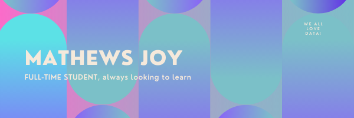

## Hi there 👋 I'm Mathews (Matt), and yes it really is spelt like that

- 🌱 I’m currently learning SQL, Python, Data Viz and some C++
- 💬 Ask me about anything you want!
- 📫 How to reach me: mathews2492@gmail.com
- ⚡ Fun fact: err, I've been to 3 countries so far in life (india, france and italy) and definitely planning on going to more!

### Tools / OS's / Frameworks I Have Experience With!
        

 

 

  

  

 

### My links

- 🌟 [Tableau Public](https://public.tableau.com/app/profile/mathews.joy), [My Website](https://mathewsjoy.herokuapp.com/index), [LinkedIn](https://www.linkedin.com/in/mathews-joy/)

